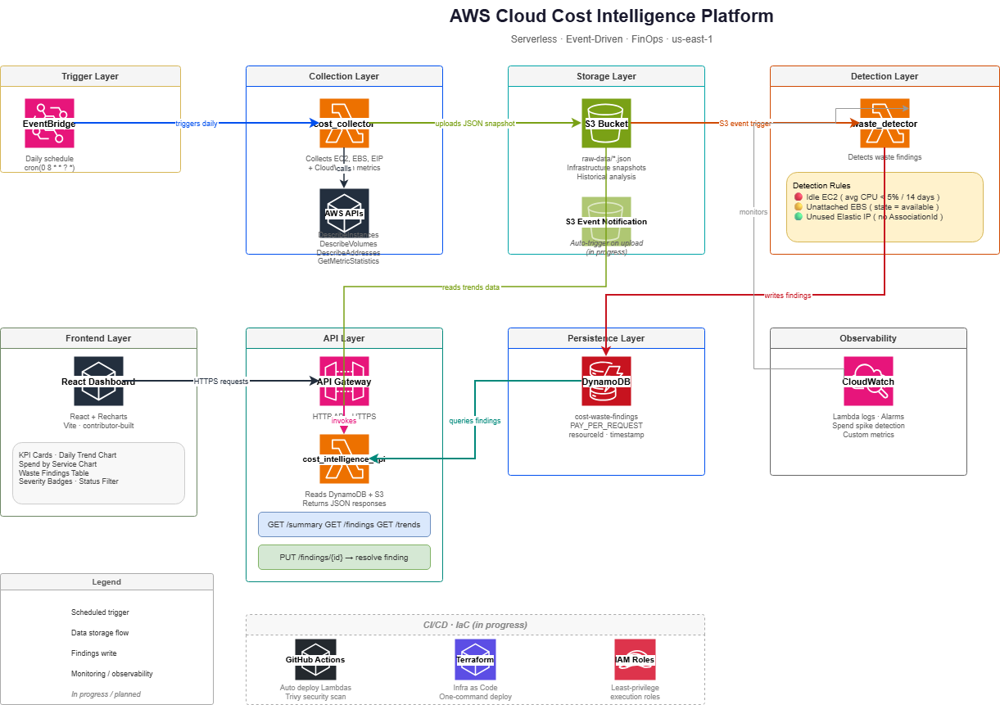

# ◈ AWS Cloud Cost Intelligence Platform

> A production-inspired, serverless FinOps platform that automatically detects AWS resource waste, generates cost optimization findings, and exposes real-time analytics APIs — built on a fully event-driven, near-zero-cost architecture.

<br/>

[](https://aws.amazon.com/)
[](https://python.org/)
[](LICENSE)
[](CONTRIBUTING.md)
[]()

---

## What This Is

Most teams overspend on AWS and don't know where. This platform:

- **Detects** idle EC2 instances, unattached EBS volumes, and unused Elastic IPs automatically
- **Calculates** estimated monthly savings per finding
- **Exposes** a live REST API for dashboards and integrations
- **Costs near zero** to run — fully serverless, no EC2, no NAT Gateway, no RDS

**Real findings on day one.** Point it at any AWS account and it immediately surfaces wasteful resources with dollar amounts attached.

---
# Architecture Diagram



## Live API

```
https://naijpkbw4m.execute-api.us-east-1.amazonaws.com
```

| Endpoint | Description |
|---|---|
| `GET /summary` | Total waste, open/resolved counts, savings realised |
| `GET /findings` | All waste findings from DynamoDB |
| `GET /trends` | Daily spend trend + cost breakdown by service |

Try it right now — open any endpoint in your browser and see real data.

---

## Architecture

```
EventBridge (daily schedule)
        │
        ▼
cost_collector Lambda         ← collects EC2, EBS, EIP inventory + CloudWatch metrics
        │
        ▼  uploads JSON snapshot
    S3 Bucket                 ← raw-data/*.json — decoupled storage, replayable
        │
        ▼  S3 event trigger
waste_detector Lambda         ← detects waste, calculates savings, writes findings
        │
        ▼  writes findings
  DynamoDB Table              ← cost-waste-findings — persists all governance data
        │
        ▼  reads data
cost_intelligence_api Lambda  ← REST API backend
        │
        ▼  via API Gateway
   React Dashboard            ← frontend (contributor-built)
```

**Design principles:**
- Serverless-first — Lambda + DynamoDB + S3, no always-on infrastructure
- Event-driven — S3 trigger decouples collector from detector
- FinOps-oriented — every finding has a dollar amount attached
- Contributor-friendly — backend and frontend are completely separated

---

## Waste Detection Rules

| Waste Type | Detection Logic | Est. Monthly Cost |
|---|---|---|
| **Idle EC2** | Average CPU < 5% over 14 days | Varies by instance type |
| **Unattached EBS** | Volume state = `available` (not attached to any instance) | $0.08–0.10/GB/month |
| **Unused Elastic IP** | EIP with no `AssociationId` | $3.60/month each |

Each finding includes: `resourceId`, `resourceName`, `wasteType`, `detail`, `estimatedMonthlySavings`, `severity`, `recommendation`, `ownerTag`, `status`, `detectedAt`.

---

## Tech Stack

| Layer | Technology |
|---|---|
| Runtime | Python 3.12 |
| Compute | AWS Lambda |
| API | AWS API Gateway (HTTP API) |
| Database | AWS DynamoDB (PAY_PER_REQUEST) |
| Storage | AWS S3 |
| Monitoring | AWS CloudWatch |
| Scheduling | AWS EventBridge |
| SDK | boto3 |
| Frontend | React + Recharts (contributor-built) |
| IaC | Terraform *(in progress)* |
| CI/CD | GitHub Actions *(in progress)* |

---

## Project Structure

```
aws-cost-intelligence/
├── lambdas/
│   ├── cost-collector.py  # collects AWS inventory + CloudWatch metrics
│   │         
│   ├── waste-detector.py # detects waste, writes findings to DynamoDB
│   │           
│   └── api-handler.py    # REST API — reads DynamoDB + S3
│             
├── frontend/                   # React dashboard (contributor scope)
│   └── README.md
├── terraform/                  # Infrastructure as Code (in progress)
├── mock/
│   └── sample_data.json        # Realistic mock data for frontend development
├── docs/
│   └── api.md                  # Full API documentation with response shapes
├── .github/
│   └── workflows/
│       └── deploy.yml          # CI/CD pipeline (in progress)
├── CONTRIBUTING.md
└── README.md
```

---

## API Response Examples

### `GET /summary`
```json
{
  "openFindingsCount": 8,
  "resolvedFindingsCount": 4,
  "totalEstimatedWaste": 213.50,
  "totalSavingsRealised": 46.56,
  "findingsByType": {
    "idle-ec2":       { "count": 3, "totalSavings": 138.24 },
    "unattached-ebs": { "count": 3, "totalSavings": 68.50  },
    "unused-eip":     { "count": 2, "totalSavings": 7.20   }
  }
}
```

### `GET /findings`
```json
{
  "findings": [
    {
      "resourceId":              "i-0abc123def456",
      "resourceName":            "staging-api-server",
      "wasteType":               "idle-ec2",
      "detail":                  "m5.large, avg CPU 2.3% over 14 days",
      "estimatedMonthlySavings": "69.12",
      "severity":                "critical",
      "recommendation":          "Consider stopping, rightsizing, or scheduling on/off.",
      "ownerTag":                "backend-team",
      "status":                  "open",
      "detectedAt":              "2025-06-05T09:00:00Z"
    }
  ],
  "count": 8
}
```

### `GET /trends`
```json
{
  "dailyTrend": [
    { "date": "2025-05-06", "spend": 26.40 },
    { "date": "2025-05-07", "spend": 27.10 }
  ],
  "byService": [
    { "service": "Amazon EC2", "cost": 412.00 },
    { "service": "Amazon RDS", "cost": 198.50 }
  ],
  "collectedAt": "2025-06-05"
}
```

---

## Current Status

| Component | Status |
|---|---|
| `cost_collector` Lambda | ✅ Complete and deployed |
| `waste_detector` Lambda | ✅ Complete and deployed |
| `cost_intelligence_api` Lambda | ✅ Complete and deployed |
| API Gateway (3 endpoints) | ✅ Live |
| DynamoDB findings table | ✅ Live |
| S3 raw data storage | ✅ Live |
| Real waste findings detected | ✅ 2 unused EIPs = $7.20/month |
| React dashboard | 🔧 In progress |
| S3 → Lambda auto trigger | ✅Complete |
| EventBridge daily schedule | ✅ Complete|
| Terraform | 🔧 In progress |
| GitHub Actions CI/CD | 🔧 In progress |

---

## Getting Started

### Prerequisites
- AWS account with free tier
- Python 3.12+
- AWS CLI configured (`aws configure`)
- Terraform (for IaC deployment)

### Deploy manually (current approach)

**1. Create DynamoDB table**
```bash
aws dynamodb create-table \
  --table-name cost-waste-findings \
  --attribute-definitions \
      AttributeName=resourceId,AttributeType=S \
      AttributeName=timestamp,AttributeType=S \
  --key-schema \
      AttributeName=resourceId,KeyType=HASH \
      AttributeName=timestamp,KeyType=RANGE \
  --billing-mode PAY_PER_REQUEST \
  --region us-east-1
```

**2. Create S3 bucket**
```bash
aws s3 mb s3://your-name-cost-intelligence --region us-east-1
```

**3. Deploy Lambda functions**
```bash
# Package and deploy cost_collector
cd lambdas/cost_collector
zip -r function.zip .
aws lambda create-function \
  --function-name cost-collector \
  --runtime python3.12 \
  --handler handler.lambda_handler \
  --zip-file fileb://function.zip \
  --role arn:aws:iam::YOUR_ACCOUNT_ID:role/lambda-execution-role \
  --region us-east-1
```

Repeat for `waste_detector` and `api`.

**4. Set environment variables on each Lambda**

| Lambda | Variable | Value |
|---|---|---|
| cost_collector | `COST_BUCKET` | your S3 bucket name |
| waste_detector | `COST_BUCKET` | your S3 bucket name |
| api | `COST_BUCKET` | your S3 bucket name |

**5. Wire API Gateway**

AWS Console → API Gateway → Create HTTP API → add routes:
- `GET /summary` → api Lambda
- `GET /findings` → api Lambda
- `GET /trends` → api Lambda

---

## IAM Permissions Required

Attach this policy to your Lambda execution role:

```json
{
  "Version": "2012-10-17",
  "Statement": [
    {
      "Effect": "Allow",
      "Action": ["ec2:DescribeInstances", "ec2:DescribeVolumes", "ec2:DescribeAddresses"],
      "Resource": "*"
    },
    {
      "Effect": "Allow",
      "Action": ["cloudwatch:GetMetricStatistics", "cloudwatch:PutMetricData"],
      "Resource": "*"
    },
    {
      "Effect": "Allow",
      "Action": ["s3:PutObject", "s3:GetObject"],
      "Resource": "arn:aws:s3:::YOUR_BUCKET_NAME/*"
    },
    {
      "Effect": "Allow",
      "Action": ["dynamodb:PutItem", "dynamodb:Scan", "dynamodb:UpdateItem", "dynamodb:Query"],
      "Resource": "arn:aws:dynamodb:us-east-1:*:table/cost-waste-findings"
    },
    {
      "Effect": "Allow",
      "Action": ["ce:GetCostAndUsage"],
      "Resource": "*"
    },
    {
      "Effect": "Allow",
      "Action": ["logs:CreateLogGroup", "logs:CreateLogStream", "logs:PutLogEvents"],
      "Resource": "*"
    }
  ]
}
```

---

## Contributing

We welcome contributions. The project is split into clear scopes so you can contribute without needing to understand the full stack.

### Frontend (React dashboard)
The backend API is live. Build the UI against it — no AWS account needed.
- Mock data: `mock/sample_data.json`
- API docs: `docs/api.md`
- Scope: `frontend/` folder only

### DevOps
- Terraform modules for full infrastructure provisioning
- GitHub Actions CI/CD pipeline
- LocalStack docker-compose for local development

### Backend
- Pagination for `/findings` endpoint
- Additional waste detection rules (oversized RDS, old snapshots)
- Structured logging improvements

See [CONTRIBUTING.md](CONTRIBUTING.md) for setup instructions and open issues.

---

## Estimated Running Cost

| Service | Cost |
|---|---|
| Lambda (3 functions, daily runs) | ~$0.00 (free tier) |
| DynamoDB (PAY_PER_REQUEST, low volume) | ~$0.00 (free tier) |
| S3 (small JSON files) | ~$0.01/month |
| API Gateway (HTTP API) | ~$0.00 (free tier) |
| CloudWatch Logs | ~$0.01/month |
| **Total** | **~₹0–10/month** |

---

## Roadmap

- [ ] Terraform for all infrastructure
- [ ] GitHub Actions CI/CD
- [ ] React dashboard (contributor)
- [ ] Slack alerts for new findings
- [ ] Athena integration for historical analysis
- [ ] Governance dashboard (compliance score, team leaderboard)
- [ ] Cost anomaly detection
- [ ] Multi-account support

---

## Future Scope & Planned Features

- Multi-cloud cost monitoring support (AWS, Azure, GCP)
- AI-based cloud cost optimization recommendations
- Monthly cost forecasting and prediction analytics
- Real-time AWS cost anomaly detection
- Slack, Microsoft Teams, and email alert integrations
- Kubernetes and EKS cost monitoring
- Multi-account AWS Organizations cost aggregation
- IAM security and compliance insights
- Carbon footprint and sustainability metrics
- Automated savings recommendation engine
```
 

## Author

**Kadiyala Sudheer Kumar**
Project Engineer · Wipro · Chennai

[](https://sudheerkadiyala2.github.io/portfolio)
[](https://www.linkedin.com/in/kadiyala-sudheer-kumar-760677259/)
[](https://github.com/sudheerkadiyala2)

---

## License

MIT License — see [LICENSE](LICENSE) for details.

---

<div align="center">
  <sub>Built with Python · AWS Lambda · DynamoDB · S3 · API Gateway · CloudWatch</sub>
</div>

